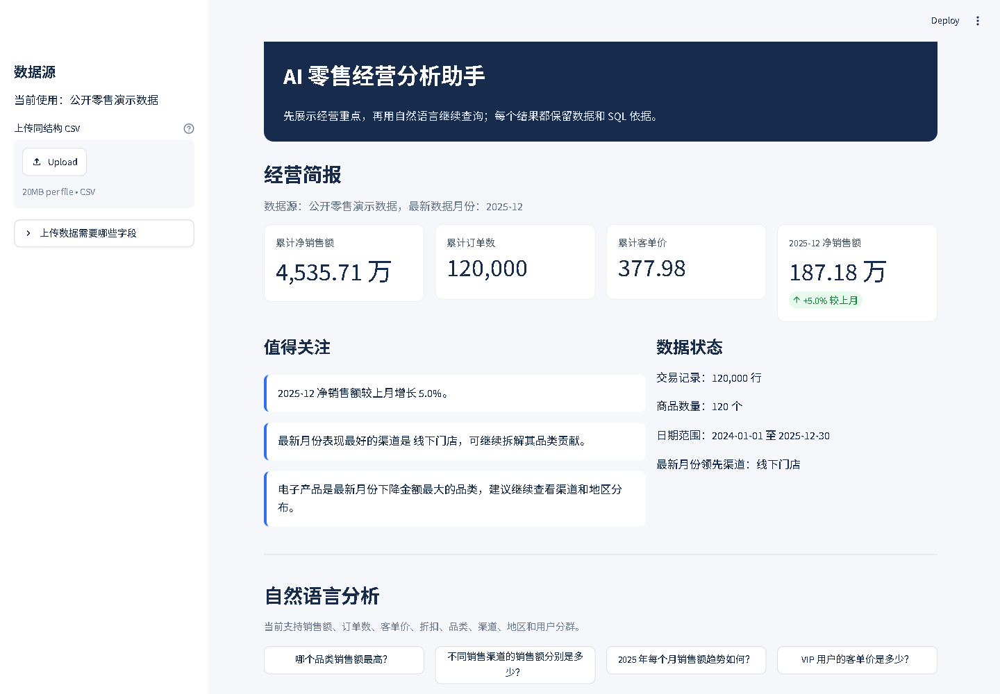
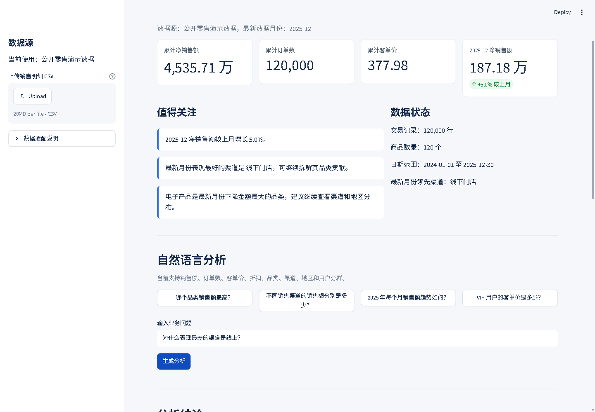
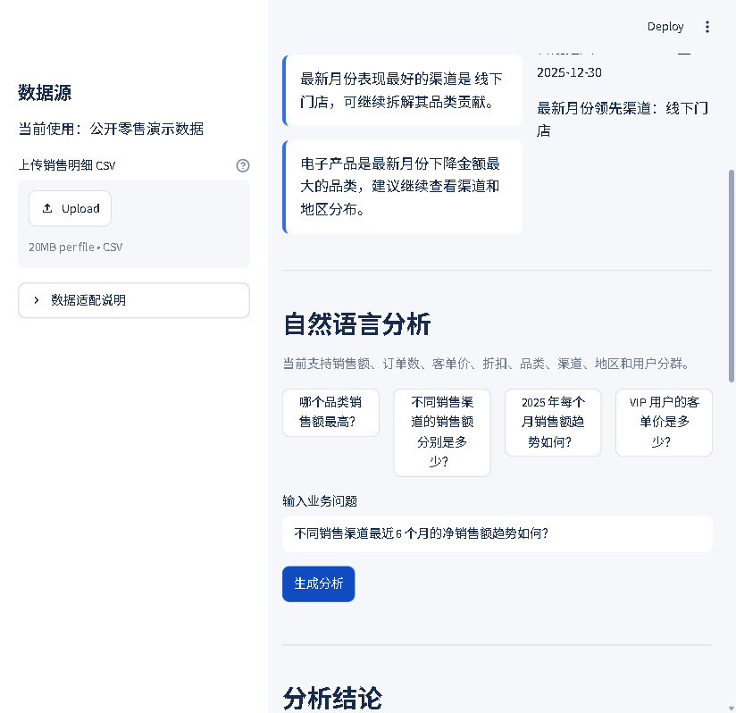
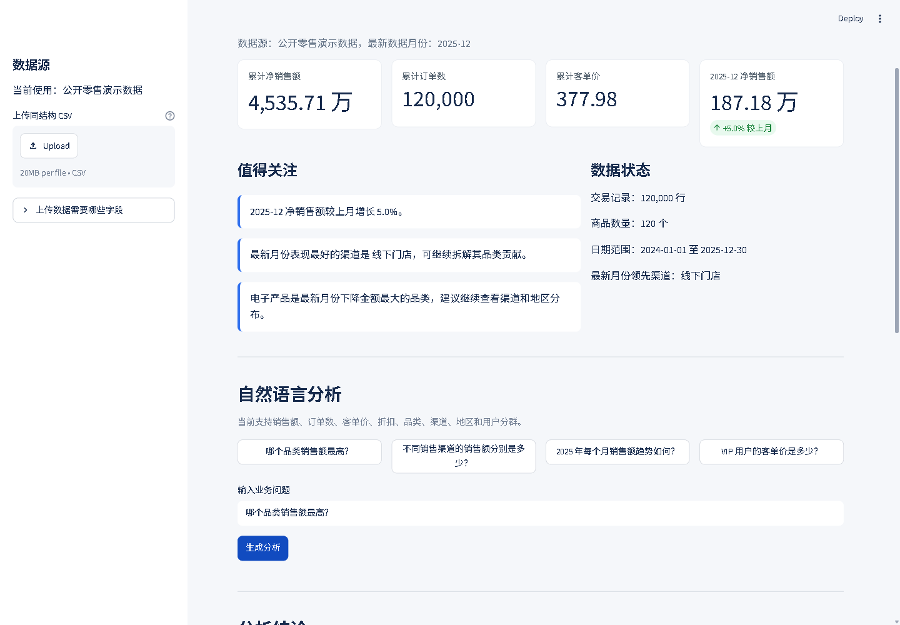
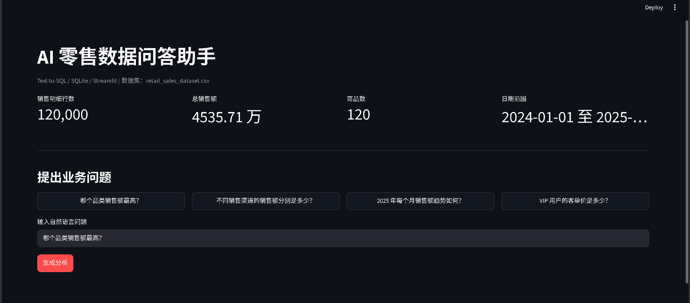
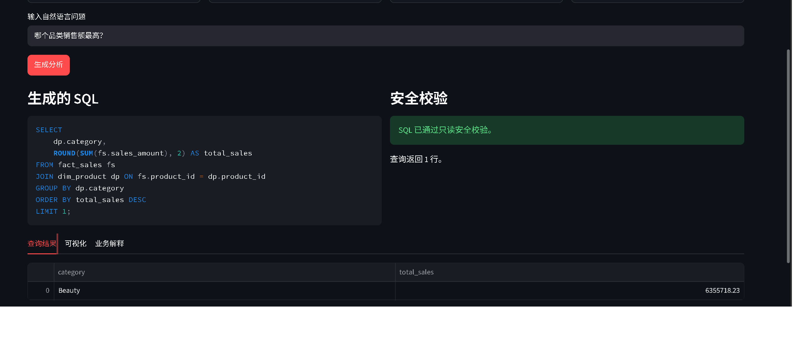

# AI 零售经营分析助手

面向零售运营场景的 AI 数据产品原型。页面先用确定性 SQL 展示经营简报和关注点，用户再通过自然语言继续查询；V2.2 增加受控运营 Agent 工作台，支持订单、库存、退货政策查询，以及需人工批准的退货申请演示。

这个项目面向 AI 产品实习、数据产品实习和 AI 应用落地实习场景，重点展示需求理解、数据建模、Prompt 约束、安全校验、评测集设计和 Bad Case 复盘能力。

## 项目亮点

- 经营简报：无需提问即可查看核心指标、月度变化、领先渠道和下降明显的品类。
- 自然语言分析：支持品类销售、渠道对比、时间趋势、用户分层等业务问题。
- 分析引导：结果优先展示结论和图表，并提供三个带明确业务实体的推荐追问。
- 可配置语义层：表、字段、关联、指标、同义词和能力边界由独立 JSON 配置维护。
- 会话数据源：自动映射常见中英文字段名、补全可选字段，并创建会话级临时 SQLite，不覆盖公共演示数据库。
- 诊断问答：对“为什么某渠道最差”先校验问题前提，再拆解订单数和客单价；缺少因果数据时明确说明不能证明原因。
- 可信结论：趋势、排名和汇总结果由查询结果确定性计算，避免大模型复述数字时产生前后矛盾。
- 受控运营 Agent：根据任务选择订单、库存和政策工具；退货申请依次完成订单查询、政策检索、资格判断和动作提议。
- 人工审批与幂等：读操作自动执行；写操作在用户确认前暂停，批准后只写入独立演示库，重复提交复用原申请。
- 执行可追溯：记录任务路由、工具、状态和说明，页面可查看当前会话审计日志。
- 安全控制：拦截删除、修改、建表等危险意图；只允许只读 SQL 查询。
- 评测闭环：维护固定评测集、自动记录评测结果、沉淀 Bad Case，并生成评测报告。
- 真实反馈迭代：根据 3 名体验用户的两轮负面反馈完成 V2.1 修复，等待原用户再次验收。

## 技术栈

- Python
- Streamlit
- SQLite
- Pandas
- Plotly
- OpenAI-compatible API
- python-dotenv

## 数据集

数据来源：公开零售销售数据集 `retail_sales_dataset.csv`

当前数据规模：

- 销售明细行数：120,000
- 商品数：120
- 时间范围：2024-01-01 至 2025-12-30
- 核心字段：品类、品牌、渠道、地区、用户分层、销售额、折扣、支付方式

数据库拆分：

- `fact_sales`：销售事实表，保存订单、用户属性、渠道、地区、销售额等交易信息。
- `dim_product`：商品维度表，保存商品名称、品类、品牌和单价。

运营工作台另外使用 `ops_orders`、`inventory_snapshot` 和 `return_policies`。这些表由公开销售数据确定性生成，只用于演示工具调用和审批流程，不是真实履约、库存或售后数据；页面固定标注演示日期为 `2025-12-31`。

## 功能截图

### V2 经营简报



### V2.1 渠道问题诊断



### V2.1 多渠道趋势



### V2 分析结论与推荐追问



### 首页与数据概览



### 自然语言生成 SQL



### 查询结果与可视化


### 危险请求拦截


## 核心流程

```text
语义配置加载表结构、关联、指标和业务词
-> SQL 计算经营简报与关注点
-> 用户输入业务问题或点击推荐追问
-> Prompt 注入语义配置
-> 大模型生成 SQLite SQL
-> SQL 安全校验
-> 查询 SQLite 数据库
-> 由结果确定性计算排名、趋势、峰值和变化率
-> 展示结论、图表和推荐追问
-> 折叠展示数据明细与 SQL 依据
-> 记录评测结果和 Bad Case
```

受控运营 Agent 流程：

```text
用户输入运营任务
-> 确定性路由到允许调用的工具
-> 只读查询订单 / 库存 / 退货政策
-> 退货任务组合查询订单、检索政策和资格判断
-> 生成待执行动作
-> 人工批准后写入独立演示操作库
-> 使用幂等键防止重复创建
-> 记录路由、工具、状态和说明
```

## 安全设计

项目不连接生产数据库，默认使用本地 SQLite 演示库。上传数据只生成当前会话独立的临时 SQLite，不覆盖公共演示库。安全规则包括：

- 用户输入包含删除、修改、建表等危险意图时直接拒绝执行。
- SQL 只允许 `SELECT` 或只读 `WITH ... SELECT` 查询。
- 拦截 `DROP / DELETE / UPDATE / INSERT / ALTER / CREATE / REPLACE / TRUNCATE` 等危险关键词。
- 拦截多语句注入，例如 `SELECT ...; DROP TABLE ...`。
- API Key 只写入本地 `.env`，不提交到代码仓库。
- Agent 只能调用明确注册的订单、库存和政策工具，不能生成任意数据库写操作。
- 退货申请在人工批准前停留在 `waiting_approval`，分析库始终只读。
- 写操作只进入 `agent_actions.db` 演示库，并使用幂等键阻止重复申请。

## 评测结果

当前黄金评测集包含 15 条普通业务问题，覆盖指标、品类、渠道、用户分层、时间趋势、空结果和能力边界。以下结果只代表这 15 条预设问题，不代表开放式真实提问准确率。

最新评测摘要：

- 普通业务问题数：15
- SQL 执行成功率：100.00%
- 答案正确率：100.00%
- Bad Case 数量：0

详细报告见：[docs/evaluation-report.md](docs/evaluation-report.md)

运营 Agent 另有 30 条固定任务评测，覆盖订单、库存、政策、退货申请、缺失参数、未知对象和宽泛请求：

- 任务数：30
- 路由正确：30/30
- 最终状态正确：30/30
- 完整通过：30/30

该结果只代表固定演示任务，不代表开放式客服请求准确率。详细报告见：[docs/agent-evaluation-report.md](docs/agent-evaluation-report.md)。

## 用户反馈与 V2 决策

第一轮邀请 3 名非 SQL 用户体验，反馈集中在三类问题：主动查数的使用价值不足、页面和结果不如直接看表、固定数据源无法说明扩展性。

V2 据此增加经营简报、推荐追问、结果依据折叠、可配置语义层和会话级临时数据源。第二轮继续暴露出“为什么”类回答不校验前提、多系列图表错误连接、英文枚举难读和跨公司字段适配不足。V2.1 已完成针对性修复，但尚未请原 3 名用户重新验收，因此不将功能完成等同于用户认可。记录见 [docs/user-test-round2.md](docs/user-test-round2.md)。

## 项目结构

```text
ai-data-assistant/
  app.py                         # Streamlit 产品原型页面
  config/
    semantic_model.json         # 表、字段、指标、关联、业务词和能力边界
  requirements.txt               # Python 依赖
  data/
    raw/retail_sales_dataset.csv # 原始公开数据集
    app.db                       # SQLite 数据库
  src/
    db.py                        # 数据入库与 SQL 查询
    semantic_model.py            # 语义配置读取、校验和 Prompt 上下文生成
    data_adapter.py              # 常见中英文字段识别、补全和标准化
    diagnostics.py               # 渠道前提校验与指标拆解
    insights.py                  # 确定性经营简报与关注点
    result_summary.py            # 从查询结果确定性生成排名和趋势结论
    followups.py                 # 推荐追问规则
    ops_data.py                  # 合成订单、库存和政策演示数据
    ops_agent.py                 # 工具路由、退货审批、幂等和审计日志
    evaluate_agent.py            # 运营 Agent 固定任务评测
    llm.py                       # 大模型 API 调用
    prompts.py                   # Text-to-SQL Prompt
    evaluator.py                 # SQL 安全校验
    evaluate.py                  # 自动评测脚本
    report.py                    # 评测报告生成脚本
  eval/
    questions.csv                # 评测问题集
    results.csv                  # 自动评测结果
    bad_cases.csv                # Bad Case 记录
    agent_tasks.csv              # 30 条运营 Agent 固定任务
    agent_results.csv            # Agent 路由和最终状态评测结果
  docs/
    prd.md                       # 产品需求文档
    project-summary.md           # 项目背景、用户需求、产品方案、落地过程和复盘总结
    data-source.md               # 数据来源说明
    data-dictionary.md           # 数据字典
    prompt-design.md             # Prompt 设计记录
    evaluation-report.md         # 评测报告
    security-checklist.md        # 安全清单
    user-test-round1.md          # 第一轮真实体验反馈
    user-test-round2.md          # 第二轮反馈、截图和 V2.1 决策
    v2-prd.md                    # V2 产品需求和验收标准
    agent-design.md              # V2.2 Agent 方案、风险和边界
    agent-evaluation-report.md   # Agent 离线评测报告
    resume-version.md            # 简历写法
  screenshots/                   # 项目截图
  tests/                         # 自动化测试
```

## 本地运行

### 1. 创建虚拟环境并安装依赖

```powershell
python -m venv .venv
.\.venv\Scripts\activate
pip install -r requirements.txt
```

### 2. 配置大模型 API

在项目根目录新建 `.env` 文件：

```text
LLM_API_KEY=你的 API Key
LLM_BASE_URL=你的 OpenAI-compatible API 地址
LLM_MODEL=你的模型名称
```

### 3. 构建数据库

```powershell
python src/db.py
```

### 4. 启动 Demo

```powershell
streamlit run app.py
```

打开浏览器访问：

```text
http://localhost:8501
```

## 自动评测

先小范围测试 3 条：

```powershell
python -m src.evaluate --limit 3
```

跑完整评测集：

```powershell
python -m src.evaluate
```

生成评测报告：

```powershell
python -m src.report
```

运行运营 Agent 的 30 条固定任务评测：

```powershell
python -m src.evaluate_agent
```

## 测试

```powershell
python -m unittest discover -s tests
```

当前共有 35 项单元测试，覆盖原有查询链路、V2.1 分析能力和 V2.2 运营 Agent：

- SQL 安全校验
- 只读 CTE 查询放行
- 危险语句拦截
- 评测结果写入
- 评测报告生成
- 语义配置读取与错误校验
- 常见中文销售字段映射、校验和隔离建库
- 经营简报月度计算
- 推荐追问包含明确业务实体
- 渠道问题前提核对和因果边界
- 趋势结论峰值、最新值和变化率核对
- 订单、库存和退货政策工具查询
- 退货窗口与订单状态判断
- 未批准写操作阻断
- 已批准申请写入和幂等复用
- 工具调用审计日志

## 简历写法

项目名称：AI 零售经营分析助手

可写描述：

- 基于 12 万行公开零售销售数据，设计面向产品/运营人员的 AI 经营分析原型，支持经营简报、自然语言查询、可视化结论、推荐追问和 SQL 依据复核。
- 将表结构、指标口径、业务词映射和能力边界从 Prompt 中拆为可配置语义层，增加常见中英文字段自动映射和会话级临时数据源。
- 针对真实用户提出的“为什么线上最差”问题，设计前提校验与订单数、客单价拆解；重写多系列图表规则，并将文字结论改为确定性计算。
- 设计 SQL 安全校验机制，拦截删除、修改、建表等危险意图，限制系统仅执行只读查询，并支持只读 `WITH ... SELECT` 场景。
- 当前 15 条预设黄金问题的 SQL 执行成功率和答案正确率均为 100%，该结果仅用于固定回归测试，不泛化到开放式问题。
- 增加订单、库存、政策查询与退货申请受控工作流；写操作必须人工批准，并通过独立操作库、幂等键和审计日志降低误执行风险。
- 构建 30 条 Agent 固定任务评测，当前路由和最终状态均为 30/30；该数字仅表示固定回归任务通过。

## 项目边界

本项目是学习和求职展示用的 AI 数据产品原型，不连接生产数据库，不包含登录权限、实时数据更新和企业级权限管理。上传能力面向单张销售明细表，可识别一组常见中英文字段别名；不能自动合并任意多表、理解企业数仓或完成权限接入。运营 Agent 使用合成演示数据，不会调用真实订单、库存、退款或支付系统；当前确定性路由只覆盖明确的订单、库存和退货任务，不应描述为可自主完成任意客服工作的通用 Agent。
