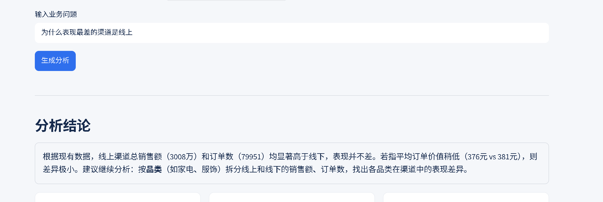
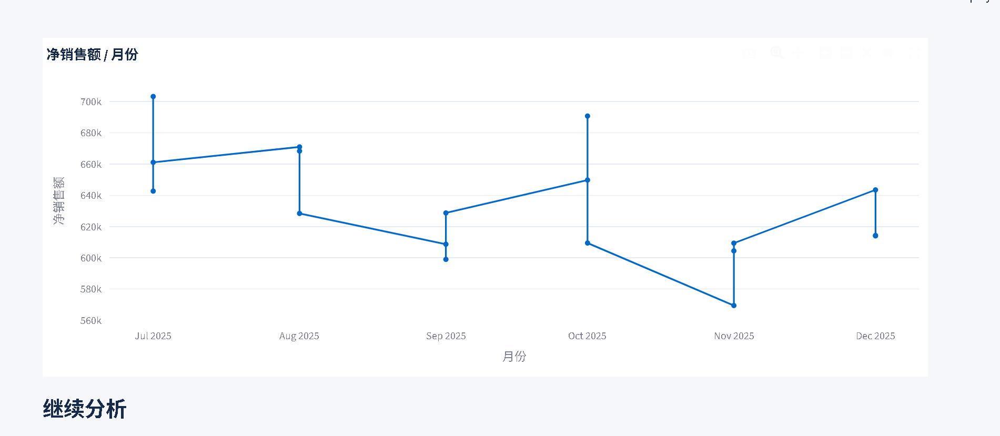

# 第二轮真实用户任务测试记录

记录日期：2026-07-13

测试版本：V2，AI 零售经营分析助手

测试对象：尽量邀请第一轮的 U1、U2、U3

说明：本轮已收集 3 名用户的定性反馈和 2 张页面截图，但没有完整记录固定任务耗时与提示次数，因此不能宣称第二轮验收通过。以下反馈用于继续开发 V2.1。

## 本轮实际反馈

U1：认为对“为什么表现最差的渠道是线上”的回答不知所云、不够智能，仍然替代不了人工分析。

问题判断：系统没有先核对“线上最差”这个前提，也没有把销售额拆成订单数、客单价和品类贡献，只是复述汇总数据并给出宽泛建议。

U2：认为图表难以理解，英文值影响阅读；月份折线图形态怪异，柱状图过粗，整体视觉仍然不好。

问题判断：同一月份存在多组系列时，旧选图逻辑只取第一个文本列，导致不同渠道或品类的点被一条折线串联；金额单位和枚举值也没有完整中文化。

U3：认为新增数据格式要求仍然严格，同一家公司持续使用可以，但无法直接复用于其他公司。

问题判断：V2 解决了同结构数据更新，没有解决不同公司字段命名不同的问题。下一步需要增加常见中英文字段自动映射和缺省字段补全，但仍不能宣称自动理解任意复杂数据库。

## 固定任务

任务 1：不输入问题，在两分钟内说出当前最值得关注的经营变化。

任务 2：查询“哪个品类销售额最高”，再通过推荐追问查看该品类的渠道表现。

任务 3：找到本次查询使用的数据明细和 SQL 依据。

任务 4：上传一份同结构 CSV，并确认页面的数据源和经营简报发生变化。

## 任务记录

| 用户 | 任务 1 | 任务 2 | 任务 3 | 任务 4 | 总耗时 | 提示次数 | 是否打开原始表 | 继续使用意愿 |
| --- | --- | --- | --- | --- | --- | --- | --- | --- |
| U1 | 已体验，未记录时长 | 已体验，诊断回答未通过 | 未完整记录 | 未完整记录 | 未记录 | 未记录 | 未记录 | 认为不能替代人工 |
| U2 | 已体验，未记录时长 | 已体验，图表未通过 | 未完整记录 | 未完整记录 | 未记录 | 未记录 | 未记录 | 认为图表难懂且不好看 |
| U3 | 已体验，未记录时长 | 未完整记录 | 未完整记录 | 已体验，跨公司复用未通过 | 未记录 | 未记录 | 未记录 | 认可同公司更新，质疑跨公司复用 |

任务结果填写“完成、部分完成、未完成”，并记录卡住的位置，不能只写最终是否成功。

## 测试后原话

### U1

与第一次相比：能够得到更长的解释，但“为什么”类问题仍没有完成前提核对和诊断拆解。

仍然不愿意使用的原因：回答不知所云，智能程度不足，不能替代人工判断。

最希望继续改的地方：让系统真正解释指标差异，而不是重复数字。

### U2

与第一次相比：页面层级有所变化，但图表本身仍然难以阅读。

仍然不愿意使用的原因：英文枚举、折线图错误连接和过粗柱形影响理解。

最希望继续改的地方：中文化图表、正确区分多条数据系列、改善柱宽和金额单位。

### U3

与第一次相比：已经能更新同结构数据，但适用范围仍局限在当前公司模板。

仍然不愿意使用的原因：不同公司的字段名和数据结构变化后仍需要人工改造。

最希望继续改的地方：允许常见中英文字段自动映射，并清楚说明无法自动处理的复杂情况。

## 第二轮结论

哪些问题得到改善：无需提问的经营简报、结果依据折叠和同公司数据更新已经可用。

哪些问题仍然存在：为什么类问题缺少诊断、图表选择存在逻辑错误、跨公司字段适配不足。

下一轮优先修改：渠道表现诊断、多系列图表、中文金额单位、中英文字段自动映射。

## V2.1 已实施改动

1. 对“为什么表现最差的渠道是线上”新增专用诊断：先比较网页端、手机端和线下门店，再统一线上口径，若前提错误直接纠正；同时拆解订单数和客单价，并说明现有字段不能证明因果。
2. 修复同一月份不同渠道被一条折线串联的问题；按渠道拆成独立曲线，月份、图例、坐标轴和万元单位中文化，单条汇总不再绘制粗柱。
3. 新增销售明细适配层，已用“订单号、交易日期、品类、销售渠道、销售额、数量”中文字段文件完成浏览器验证。
4. 趋势、排名、峰值和变化率改为由查询结果确定性计算，避免模型复述数字时出现矛盾。

实现完成不等于用户认可。下一步仍需让 U1、U2、U3 使用相同任务复测，并补录耗时、提示次数和继续使用意愿。

## 简历表达检查

复测完成前，不写“用户认可”“提升使用意愿”或任何改善数字。

复测完成后，只写表格中能够核对的任务完成情况、耗时变化或用户原话对应的改进，不把 3 人结果泛化为市场结论。
